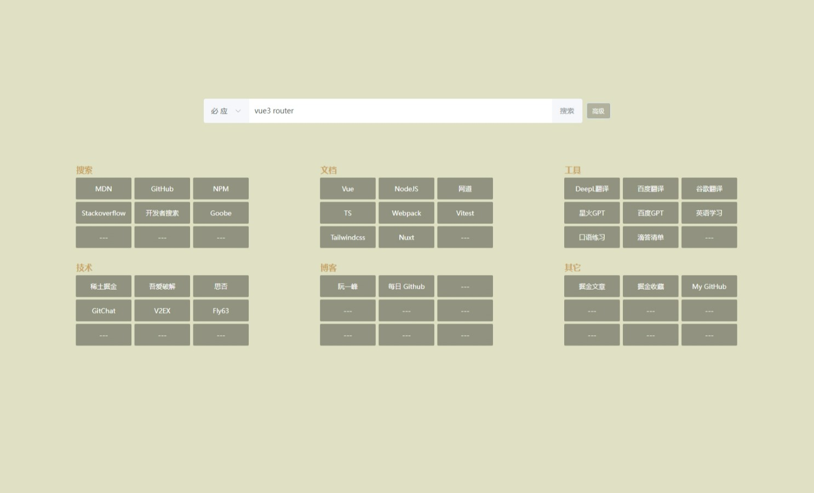
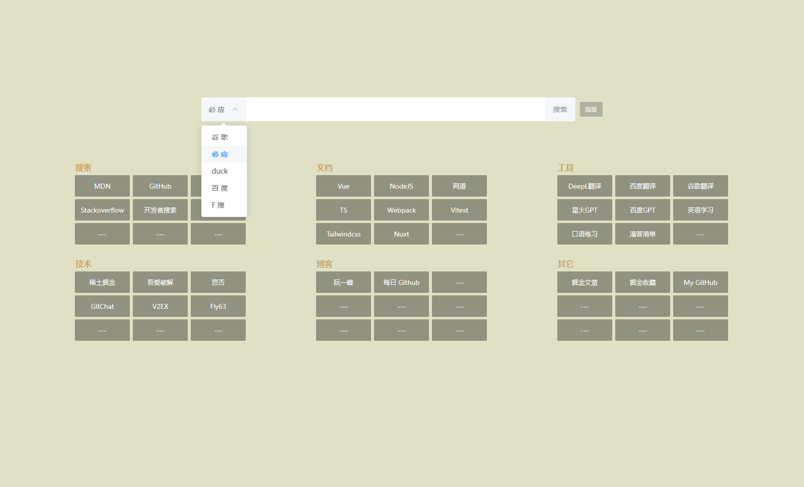
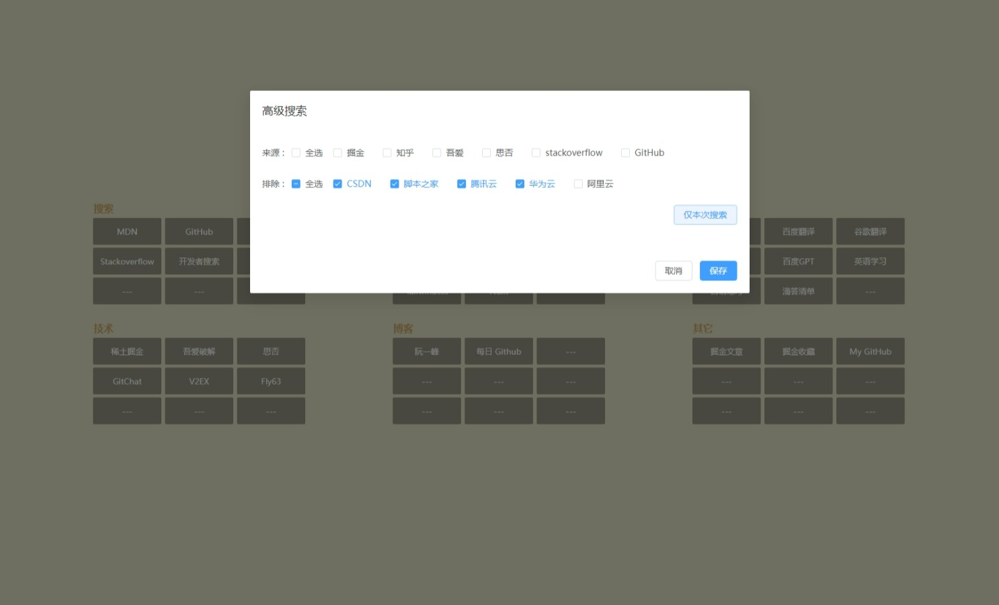

# 前端搜索

**主打前端简约高效搜索**

## Demo

- 
- 
- 

## 演示地址

- GitHub 访问[地址](https://liudewa888.github.io/)
- 快速访问[地址](http://liudewa.cc/nav)

## 更新说明

### 最近更新

- [x] 工具: 英语练习
- [x] 工具: 滴答清单
- [x] 其它: 掘金文章
- [x] 其它: 掘金收藏
- [x] 新增: 快捷键`/`,获取输入焦点
- [x] 新增: 组合键`ctrl` + `/`,清空输入框并获取输入焦点
